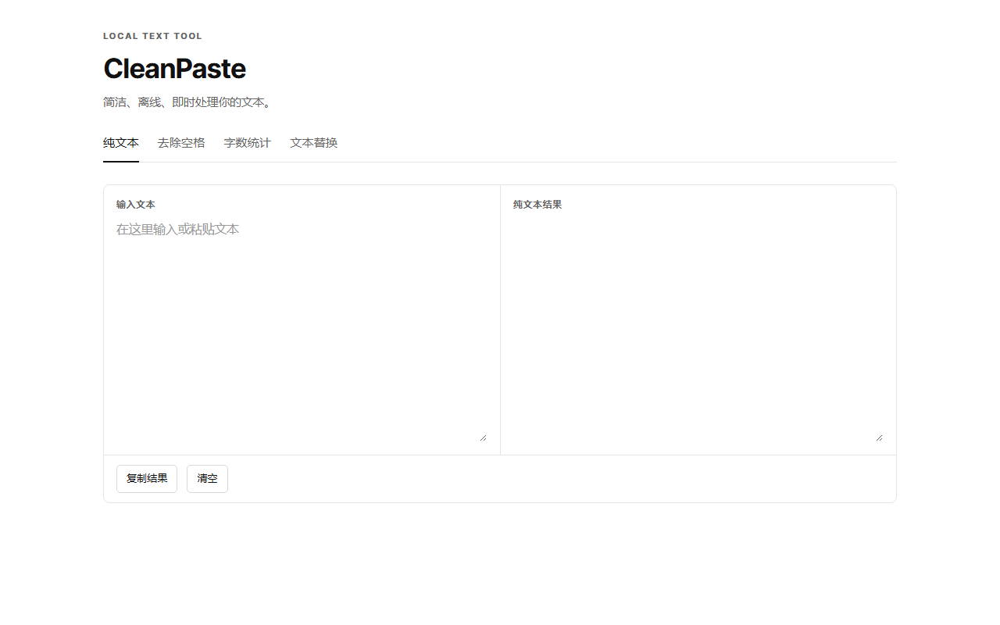

# CleanPaste

> Windows 原生本地文本工具 · Tauri 2 + React 19 + TypeScript 5 + Rust stable · 当前版本 v0.1.0

CleanPaste 是一个面向 Windows 的轻量级本地文本实时处理工具。文本处理完全在本机离线完成，不上传文本、不依赖云端服务，也不包含遥测。

## 🧩 功能

- **纯文本**：粘贴或输入文本后实时生成纯文本结果。粘贴时只读取 `text/plain`，去除 HTML/CSS、字体、颜色、粗体和超链接样式等富文本格式，但保留文字、网址字符和换行，适合清理从网页或 AI 工具复制的内容。
- **去除空格**：移除半角空格、全角空格和 Tab，保留换行。
- **字数统计**：实时统计汉字、英文单词、字母、数字项、标点、纯字数、总字数、字符数。
- **文本替换**：按字面值实时替换全部匹配项，显示预览和替换次数；查找为空时保留原文。

### 字数统计规则

| 统计项 | 计数规则 |
| --- | --- |
| 汉字 | 按 Unicode 汉字逐个计数。 |
| 英文单词 | 连续英文字母算一个单词；英文缩写中的撇号和连字符不拆分，例如 `don't`、`well-known` 各算 1 个单词。 |
| 字母 | 统计所有 ASCII 英文字母 `A-Z`、`a-z`，单词中的每个字母都会计数。 |
| 数字项 | 连续数字算一个数字项，例如 `2026` 算 1 项。 |
| 标点 | 按 Unicode 标点符号逐个计数，中英文标点均包含在内。 |
| 纯字数 | 汉字数 + 英文单词数。 |
| 总字数 | 纯字数 + 数字项数 + 标点数；空格、Tab 和换行不计入。 |
| 字符数 | 按 Unicode 字符计数，Emoji 和 surrogate pair 不会被拆成两个字符。 |

语言判断根据汉字数和英文字母数进行：同时包含中文和英文时显示“中英混合”，只包含中文时显示“中文”，只包含英文时显示“英文”。例如 `你好 CleanPaste 2026!` 的汉字为 2、英文单词为 1、字母为 10、数字项为 1、标点为 1、纯字数为 3、总字数为 5，语言显示“中英混合”。

## 🖼️ 界面预览

## ⌨️ 快捷键

| 快捷键 | 操作 |
| --- | --- |
| `Ctrl + Alt + C` | 显示或隐藏 CleanPaste；显示时自动置前并聚焦当前输入框 |
| `Ctrl + Alt + 1` | 打开纯文本 |
| `Ctrl + Alt + 2` | 打开去除空格 |
| `Ctrl + Alt + 3` | 打开字数统计 |
| `Ctrl + Alt + 4` | 打开文本替换 |
| `Alt + 1..4` | 窗口内的备用功能切换快捷键 |

全局快捷键注册失败时，应用会显示简短的非阻塞提示，不会因此退出。

## 🛠️ 系统托盘与窗口行为

应用启动后会创建系统托盘图标。关闭窗口只会将 CleanPaste 隐藏到托盘，托盘菜单包含打开、四个功能入口和退出；双击托盘图标可以重新显示主窗口。只有点击“退出”才会结束进程。CleanPaste 使用单实例模式，重复启动时会激活已存在的窗口。

## 📦 Windows 安装

从 GitHub Release 下载以下任一安装包：

- `*.msi`：适合使用 Windows Installer 的安装流程。
- `*.exe`：NSIS 安装程序，适合直接双击安装。

## 🧱 技术栈

React、TypeScript、Vite、Tailwind CSS、Tauri 2 和 Rust。核心文本转换与统计逻辑使用可测试的纯函数，Native 层负责系统托盘、窗口生命周期、全局快捷键和单实例行为。

## 🔒 隐私

CleanPaste 只处理用户主动输入或粘贴的文本，所有处理均在本机完成。项目不上传文本、不调用远程 AI、不收集使用数据。

## 📄 许可证

[MIT License](LICENSE)
